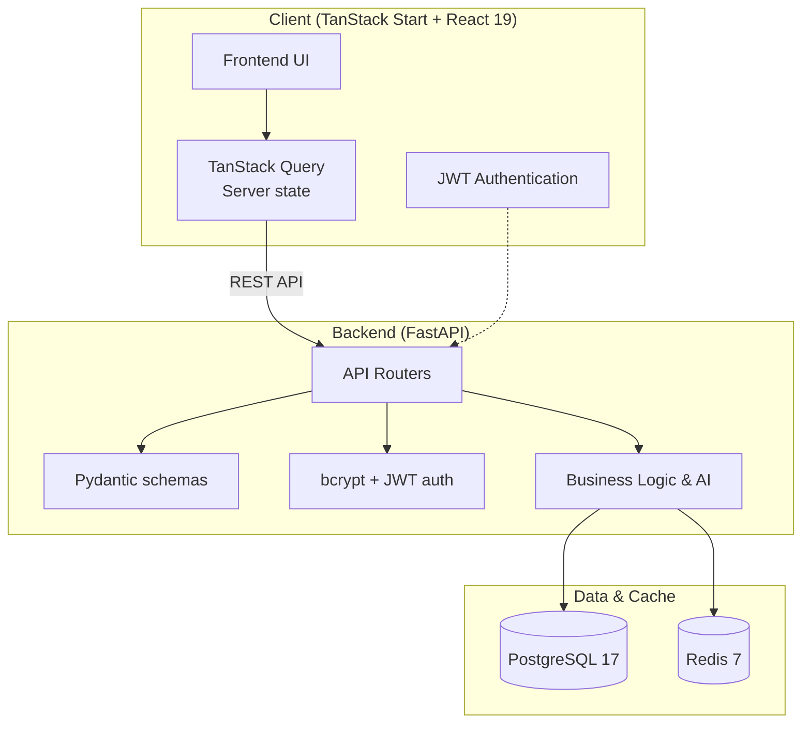

<div align="center">

<a href="https://github.com/Wahulaniket/RazorGrowth-AI">
  
</a>

# RazorGrowth AI

### AI-native Agentic Commerce Platform

Helps merchants grow revenue and become transactable by AI buyers —
RazorGrowth AI turns complex commerce operations into an automated, growth-driven engine.

<br>

[](https://fastapi.tiangolo.com/)
[](https://www.postgresql.org/)
[](https://www.sqlalchemy.org/)
[](https://redis.io/)
[](https://react.dev/)
[](https://typescriptlang.org/)
[](https://tailwindcss.com/)
[](https://tanstack.com/)

[]()

[**Quick start**](#-quick-start) ·
[**Features**](#-features) ·
[**Architecture**](#-architecture) ·
[**Tech stack**](#-tech-stack)

</div>

---

## ✨ What is RazorGrowth AI?

A **full-stack agentic commerce platform** designed to help merchants grow revenue and become transactable by AI buyers. Built with modern infrastructure like FastAPI, PostgreSQL, and TanStack Start, it provides robust backend APIs and a dynamic frontend to streamline and automate commerce.

> Not just another dashboard. A living, AI-native platform bridging merchants and autonomous buyers.

---

## 🎯 Highlights

<table>
<tr>
<td>

### 🧠 AI-Native Core
- **Agentic Commerce** integration
- **Automated growth** strategies
- **Transactable APIs** for AI buyers
- **Intelligent workflows**

</td>
<td>

### ⚡ Performance
- **FastAPI** for ultra-fast REST APIs
- **Redis 7** caching layer
- **TanStack Start** with React 19 SSR
- **Async SQLAlchemy** execution

</td>
</tr>
<tr>
<td>

### 🏗️ Robust Architecture
- **PostgreSQL 17** for reliable state
- **Alembic** migrations
- **JWT + bcrypt** authentication
- **Docker Compose** orchestration

</td>
<td>

### 🎨 Modern Frontend
- **Tailwind CSS 4** + shadcn/ui
- **TanStack Query** server state
- **React Hook Form + Zod** validation
- **Lucide** icons & rich components

</td>
</tr>
</table>

---

## 🧱 Architecture



---

## 🚀 Quick start

> Requires **Python 3.11+**, **Node 22+**, and **Docker** running locally.

### 1. Start infrastructure

```bash
docker compose up -d
```
*Starts PostgreSQL 17 (port 5432) and Redis 7 (port 6379).*

### 2. Backend setup

```bash
python -m venv .venv
# Windows: .venv\Scripts\activate | macOS/Linux: source .venv/bin/activate

pip install -r apps/api/requirements.txt
pip install -e ".[dev]"

cp .env.example .env
alembic upgrade head

cd apps/api
uvicorn app.main:app --reload --host 127.0.0.1 --port 8000
```
API explorer: **http://localhost:8000/docs**

### 3. Frontend setup

```bash
cd apps/web2
npm install
npm run dev
```
Frontend: **http://localhost:5173** (or the port Vite provides)

---

## 🌟 Features

### Agentic Commerce
- **AI Transactability** — exposes structured endpoints optimized for autonomous agents.
- **Growth Engine** — automates merchant workflows and sales strategies.

### Robust Backend
- **FastAPI + Async SQL** — high-throughput, low-latency API surfaces.
- **Redis Caching** — sub-millisecond data retrieval for frequent queries.
- **Database Migrations** — tracked natively using Alembic.

### Dynamic Frontend
- **TanStack Start & Router** — file-based routing and SSR.
- **Modern UI** — Tailwind CSS v4, shadcn/ui primitives, and Radix UI components.
- **Form Validation** — React Hook Form natively integrated with Zod schemas.

---

## 🧰 Tech stack

<table>
<tr>
<td>

**Backend**
- FastAPI
- SQLAlchemy 2.x (async)
- Alembic
- PostgreSQL 17
- Redis 7
- Pytest

</td>
<td>

**Frontend**
- React 19 + TypeScript
- Vite + TanStack Start (SSR)
- TanStack Router & Query
- Tailwind CSS 4 + shadcn/ui
- React Hook Form + Zod
- Radix UI Primitives

</td>
</tr>
</table>

---

## 📂 Repository layout

```
razorgrowth-ai/
├─ apps/
│  ├─ api/             FastAPI backend
│  └─ web2/            TanStack Start frontend
├─ infrastructure/     Docker and deployment configs
├─ migrations/         Alembic database migrations
├─ packages/           Shared packages
├─ scripts/            Utility and seed scripts
├─ tests/              Unit, integration, and e2e tests
├─ docs/               Project documentation
├─ docker-compose.yml  Postgres & Redis for local dev
└─ README.md           you are here
```

---

<div align="center">

Built to redefine commerce for the AI era.

⭐ Star the repo if you find it useful · 🐛 Open an issue if you spot a bug

</div>
